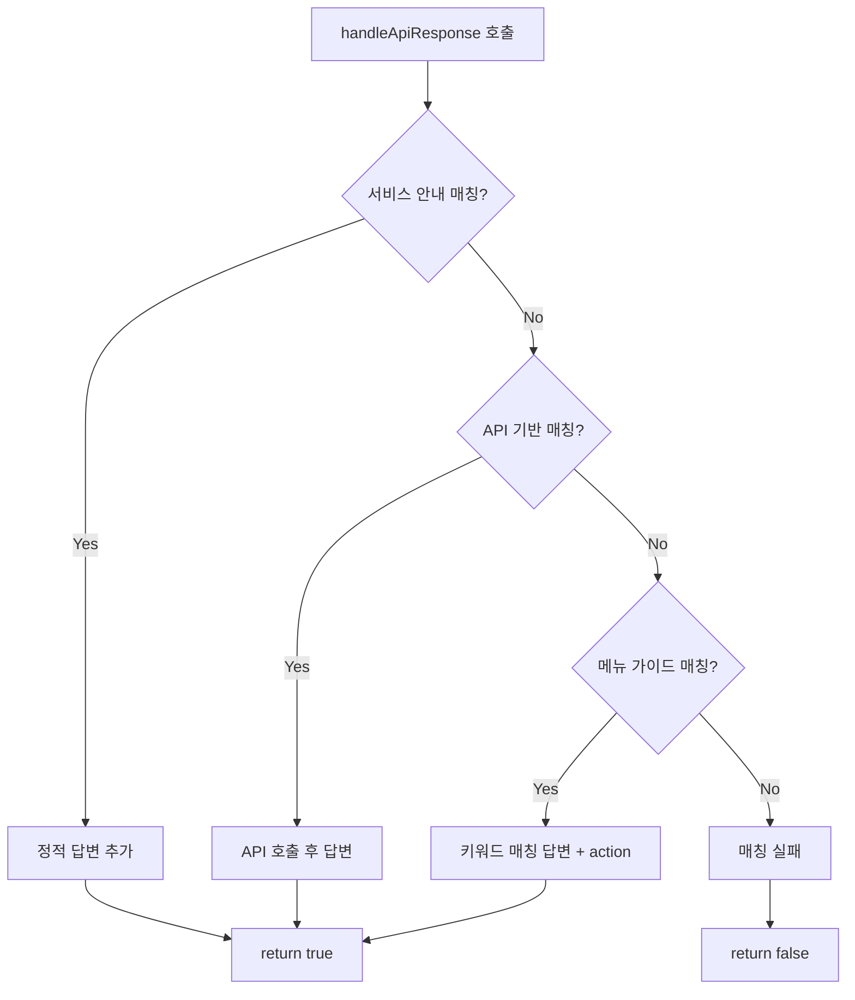
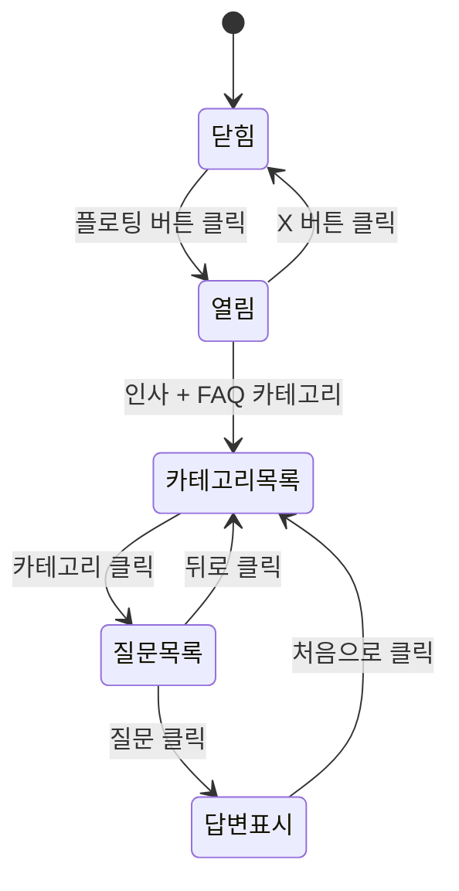

---
tags:
  - MagamGG
  - Chatbot
  - Frontend
  - React
  - FAQ
aliases:
  - 챗봇 지지 가이드
  - Chatbot Guide
created: 2025-02-10
---

# 챗봇 지지 (Chatbot) 가이드

> [!abstract] 개요
> **챗봇 지지**는 MagamGG 웹앱에서 사용자 역할(작가/담당자/에이전시 관리자)에 맞는 FAQ를 제공하고, API를 통해 실시간 데이터를 조회하는 도우미입니다.

## 목차 (Quick Links)

- [[#1 개요]]
- [[#2 파일 구조]]
- [[#3 역할 Role 기반 FAQ 구분]]
- [[#4 질문 응답 로직]]
- [[#5 메뉴 가이드 MENU_GUIDE]]
- [[#6 API 연동]]
- [[#7 UI 흐름 및 컴포넌트]]
- [[#8 섹션 네비게이션]]
- [[#9 스타일 컴포넌트]]
- [[#10 확장 가이드]]
- [[#부록 전체 매핑]]

---

## 1 개요

### 핵심 특징

> [!success] 특징
> - **역할별 FAQ**: 로그인한 사용자의 역할에 따라 다른 카테고리와 질문 목록 표시
> - **실시간 데이터 조회**: 프로젝트, 근태, 알림 등 API 호출 후 답변
> - **메뉴/위치 안내**: 키워드 매칭으로 "어디서 해요?" 질문에 답변 + 네비게이션 버튼
> - **입력 없음**: FAQ 버튼만으로 상호작용 (자유 텍스트 입력창 없음)

---

## 2 파일 구조

```
src/components/Chatbot/
├── Chatbot.jsx        # 메인 로직, FAQ 데이터, 응답 핸들러
├── Chatbot.styled.js  # styled-components
└── index.js           # export
```

> [!info] 의존성
> - `@/api` → projectService, leaveService, notificationService, agencyService
> - `@/store/authStore` → user 정보
> - `lucide-react`, `react-icons` → 아이콘
> - `motion/react` → AnimatePresence, motion

> [!example] 사용 위치
> - `FullPageLayout.jsx`에서 렌더링
> - Props: `sections`, `onNavigateToSection`, `onOpenAttendanceModal`, `userRole`

---

## 3 역할 Role 기반 FAQ 구분

### 역할 결정

```javascript
effectiveRole = userRole || user?.memberRole || 'artist'
```

<table>
<tr><th>출처</th><th>설명</th></tr>
<tr><td><code>userRole</code></td><td>App.jsx → FullPageLayout 전달 (로그인 시 매핑)</td></tr>
<tr><td><code>user?.memberRole</code></td><td>authStore의 실제 역할 값</td></tr>
</table>

**역할 매핑** (도메인 ↔ 코드값):

<table>
<tr><th>도메인 역할</th><th>코드 userRole 값</th><th>memberRole 예시</th></tr>
<tr><td><strong>ARTIST</strong> (작가)</td><td><code>artist</code></td><td>웹툰 작가, 웹소설 작가, 어시스트</td></tr>
<tr><td>MANAGER (담당자)</td><td><code>manager</code></td><td>담당자</td></tr>
<tr><td>AGENCY (에이전시)</td><td><code>agency</code></td><td>에이전시 관리자</td></tr>
</table>

### FAQ 카테고리 데이터

<table>
<tr><th>역할</th><th>상수명 (코드)</th><th>카테고리</th></tr>
<tr><td><strong>ARTIST</strong> (작가)</td><td><code>FAQ_CATEGORIES_ARTIST</code></td><td>서비스 안내, 기능 관련 질문, 근태/휴가 관련, 업무 관련, 건강 관리</td></tr>
<tr><td>MANAGER (담당자)</td><td><code>FAQ_CATEGORIES_MANAGER</code></td><td>서비스 안내, 기능 관련 질문, 근태/휴가 관련, 업무 관리, 건강 관리</td></tr>
<tr><td>AGENCY (에이전시)</td><td><code>FAQ_CATEGORIES_AGENCY</code></td><td>서비스 안내, 기능 관련 질문, 결재/승인 관련, 통계/현황, 건강 관리</td></tr>
</table>

### 카테고리 구조

```javascript
{
  id: 'about',
  label: '서비스 안내',
  icon: MdOutlineInfo,  // react-icons 컴포넌트
  questions: ['MagamGG가 무엇인가요?', '...']
}
```

### 아이콘 매핑

<table>
<tr><th>카테고리</th><th>아이콘 (react-icons/md)</th></tr>
<tr><td>서비스 안내</td><td>MdOutlineInfo</td></tr>
<tr><td>기능 관련 질문</td><td>MdOutlineSettings</td></tr>
<tr><td>근태/휴가 관련</td><td>MdOutlineEvent</td></tr>
<tr><td>업무 관련/관리</td><td>MdOutlineAssignment</td></tr>
<tr><td>건강 관리</td><td>MdOutlineFavorite</td></tr>
<tr><td>결재/승인 관련</td><td>MdOutlineCheckCircle</td></tr>
<tr><td>통계/현황</td><td>MdOutlineBarChart</td></tr>
</table>

---

## 4 질문 응답 로직

질문 문자열을 받아 **우선순위대로** 조건을 검사하고, 매칭되면 답변을 추가한 뒤 `return true`로 종료합니다.

### 처리 순서



1. **서비스 안내** (질문별 개별 답변)
   - `MagamGG가 무엇인가요?` → 공통 소개
   - 역할별 "할 수 있는 일", "시작/확인" 질문

2. **API 기반 응답**
   - 오늘 할 일, 마감 임박, 프로젝트 수, 휴가/연차 잔여, 결재 대기, 알림, 담당자 근태 신청

3. **메뉴 가이드** (위치 안내)
   - `getMenuGuideResult(query, effectiveRole)` → 키워드 매칭

4. **매칭 실패** → "아직 그 질문에는 답할 수 없어요"

### actionType

<table>
<tr><th>actionType</th><th>동작</th></tr>
<tr><td><code>attendance</code></td><td>근태 신청 모달 열기 (<code>onOpenAttendanceModal</code>)</td></tr>
<tr><td><code>section</code></td><td>해당 섹션으로 이동 (<code>sectionKeyword</code>로 인덱스 탐색)</td></tr>
</table>

---

## 5 메뉴 가이드 MENU_GUIDE

### 역할별 가이드 상수

<table>
<tr><th>도메인 역할</th><th>상수명 (코드)</th></tr>
<tr><td><strong>ARTIST</strong> (작가)</td><td><code>MENU_GUIDE_ARTIST</code></td></tr>
<tr><td>MANAGER (담당자)</td><td><code>MENU_GUIDE_MANAGER</code></td></tr>
<tr><td>AGENCY (에이전시)</td><td><code>MENU_GUIDE_AGENCY</code></td></tr>
</table>

> [!info] 상수명
> 작가 = **ARTIST**, 담당자 = **MANAGER**, 에이전시 = **AGENCY**. userRole은 <code>artist</code>, <code>manager</code>, <code>agency</code>입니다.

### 키워드 매칭 (getMenuGuideResult)

```javascript
// 조사/어미 제거 후 검색
const lower = text.replace(/\?|요|이요|에서|할|은|는|어디|봐|하나|확인|어떻게|몇|개|건/g, '').trim().toLowerCase();
const raw = text.toLowerCase();

for (const [key, guide] of Object.entries(menuGuide)) {
  if (lower.includes(key) || raw.includes(key)) {
    return { answer: guide.text, action: guide };
  }
}
```

### 가이드 객체 구조

```javascript
{
  text: '안내 문구',
  actionType: 'attendance' | 'section',
  actionLabel: '버튼에 보일 텍스트',
  sectionKeyword: '대시보드' | '프로젝트' | ...  // actionType이 section일 때
}
```

### sectionKeyword → 섹션 매핑

`findSectionIndex(keyword)`는 `sections` 배열에서 `title` 또는 `id`에 키워드가 포함된 첫 번째 인덱스를 반환합니다.

<table>
<tr><th>sectionKeyword</th><th>매칭되는 섹션</th></tr>
<tr><td>대시보드</td><td>대시보드</td></tr>
<tr><td>프로젝트</td><td>프로젝트 관리, 전체 프로젝트</td></tr>
<tr><td>캘린더</td><td>캘린더</td></tr>
<tr><td>건강</td><td>건강관리, 건강 검사, 작가 건강관리</td></tr>
<tr><td>직원</td><td>직원 관리, 전체 직원</td></tr>
<tr><td>원격</td><td>원격 관리</td></tr>
<tr><td>요청</td><td>요청 관리</td></tr>
<tr><td>할당</td><td>할당 관리</td></tr>
<tr><td>연차</td><td>연차 설정</td></tr>
</table>

---

## 6 API 연동

### 사용 API

<table>
<tr><th>API</th><th>용도</th></tr>
<tr><td><code>projectService.getMyTodayTasks()</code></td><td>오늘 마감일인 미완료 작업 수</td></tr>
<tr><td><code>projectService.getMyDeadlineCards()</code></td><td>마감 임박 작업 수</td></tr>
<tr><td><code>projectService.getMyProjectCount()</code></td><td>참여 프로젝트 수</td></tr>
<tr><td><code>leaveService.getLeaveBalance(memberNo)</code></td><td>연차 잔여 일수</td></tr>
<tr><td><code>leaveService.getAgencyPendingRequests(agencyNo)</code></td><td>에이전시 근태 승인 대기</td></tr>
<tr><td><code>leaveService.getManagerRequests()</code></td><td>담당자: 담당 작가 근태 신청 대기</td></tr>
<tr><td><code>agencyService.getJoinRequests(agencyNo)</code></td><td>가입 요청 대기</td></tr>
<tr><td><code>notificationService.getNotifications()</code></td><td>읽지 않은 알림 수</td></tr>
</table>

> [!warning] 권한/역할 제약
> - **연차 잔여**: `memberNo` 필요 (미로그인 시 "로그인 후 조회할 수 있어요.")
> - **결재 대기**: `agencyNo` 필요 (에이전시 관리자만)
> - **담당자 근태 신청**: `memberRole === '담당자'` 일 때만

---

## 7 UI 흐름 및 컴포넌트

### 상태

<table>
<tr><th>상태</th><th>타입</th><th>설명</th></tr>
<tr><td>isOpen</td><td>boolean</td><td>채팅창 열림 여부</td></tr>
<tr><td>messages</td><td>array</td><td>메시지 목록 (id, text, isUser, isGreeting?, action?)</td></tr>
<tr><td>isLoading</td><td>boolean</td><td>API 응답 대기</td></tr>
<tr><td>selectedCategory</td><td>object \| null</td><td>선택된 FAQ 카테고리</td></tr>
</table>

### UI 플로우



1. 플로팅 버튼 클릭 → `isOpen = true`
2. 인사 메시지 + FAQ 카테고리 목록 표시
3. 카테고리 클릭 → `selectedCategory` 설정 → 질문 목록 표시
4. 질문 클릭 → `handleFaqClick` → `handleApiResponse` → 답변 추가
5. 답변 하단: [처음으로] [대시보드 이동 등]
6. 처음으로 클릭 → `goToStart` → 카테고리 목록으로 복귀

### 메시지 렌더링

<table>
<tr><th>조건</th><th>렌더링</th></tr>
<tr><td><code>isUser: true</code></td><td>오른쪽 정렬, primary 배경</td></tr>
<tr><td><code>isUser: false</code></td><td>왼쪽 정렬, muted 배경</td></tr>
<tr><td><code>isGreeting</code> + <code>messages.length === 1</code></td><td>FAQ 카테고리/질문 목록</td></tr>
<tr><td><code>!isGreeting</code></td><td>ActionButtonsRow (처음으로, Navigate)</td></tr>
</table>

---

## 8 섹션 네비게이션

### sections 구조 (App.jsx)

```javascript
{ id: 'dashboard', title: '대시보드', content: <SomePage /> }
```

역할별로 `sections` 배열이 다릅니다.

### navigateToSection

Chatbot에서 `onNavigateToSection(idx)` 호출 → FullPageLayout의 `navigateToSection` 실행 → `activeSection` 변경 → 해당 페이지 표시. 채팅창은 열린 상태 유지.

---

## 9 스타일 컴포넌트

### 주요 컴포넌트

<table>
<tr><th>컴포넌트</th><th>역할</th></tr>
<tr><td>ChatbotWrapper</td><td>fixed, bottom-right, z-index 50</td></tr>
<tr><td>ChatWindow</td><td>460x480, glassmorphism, spring 애니메이션</td></tr>
<tr><td>ChatHeader</td><td>primary 그라데이션, 닫기 버튼</td></tr>
<tr><td>MessageList</td><td>스크롤 영역, padding 16px</td></tr>
<tr><td>MessageGroup</td><td>메시지 + 액션 버튼 그룹</td></tr>
<tr><td>MessageBubble</td><td>말풍선 (max-width 85%)</td></tr>
<tr><td>FloatingButton</td><td>56x56, primary 그라데이션</td></tr>
<tr><td>FaqCategoryButton</td><td>카테고리 버튼 (아이콘 + 라벨 + ChevronRight)</td></tr>
<tr><td>FaqQuestionButton</td><td>질문 버튼</td></tr>
<tr><td>BackToTopButton</td><td>처음으로</td></tr>
<tr><td>NavigateButton</td><td>섹션 이동 / 근태 신청</td></tr>
</table>

### 레이아웃

- 채팅창: `width: 460px`, `max-width: calc(100vw - 48px)`
- 봇 메시지: `align-self: stretch`
- FAQ 목록: `width: 100%`, `align-self: stretch`

---

## 10 확장 가이드

> [!tip] 새 FAQ 질문 추가
> 1. `FAQ_CATEGORIES_*`의 `questions`에 문자열 추가
> 2. `handleApiResponse`에 매칭 조건 및 답변 로직 추가 (우선순위 고려)

> [!tip] 새 메뉴/위치 안내 추가
> 1. 역할별 `MENU_GUIDE_*`에 키워드-가이드 객체 추가
> 2. `sectionKeyword`는 `sections[].title` 또는 `id`와 매칭되도록 설정

> [!tip] 새 API 기반 답변 추가
> 1. `handleApiResponse`에 키워드 조건 추가
> 2. API 서비스 호출
> 3. `addMessage(text, false, action?)`로 답변 추가

> [!tip] 새 역할 추가
> 1. `FAQ_CATEGORIES_새역할`, `MENU_GUIDE_새역할` 정의
> 2. `getFaqCategoriesForRole`, `getMenuGuideForRole`에 분기 추가
> 3. App.jsx에서 `userRole` 매핑 추가

---

## 부록 전체 매핑

### 서비스 안내 (역할별)

- MagamGG가 무엇인가요? → 공통 소개
- 역할별 "할 수 있는 일" → 역할별 기능 안내
- 역할별 "시작/확인" → 역할별 가이드

### API 기반

- 오늘 할 일 / 할일 → getMyTodayTasks
- 마감 임박 → getMyDeadlineCards
- 프로젝트 몇 개 → getMyProjectCount
- 휴가/연차 잔여 → getLeaveBalance
- 결재 대기 (에이전시) → getAgencyPendingRequests + getJoinRequests
- 알림 → getNotifications
- 담당자 근태 신청 → getManagerRequests

### 메뉴 가이드 키워드

휴가, 연차, 근태, 병가, 취소, 출퇴근, 대시보드, 할 일, 프로젝트, 칸반, 캘린더, 일정, 마감, 알림, 피드백, 진행률, 건강, 검진, 설문, 직원, 승인, 원격, 워케이션, 결재, 요청, 가입, 반려, 할당, 출석, 분포, 준수율, 미검진, 현황
